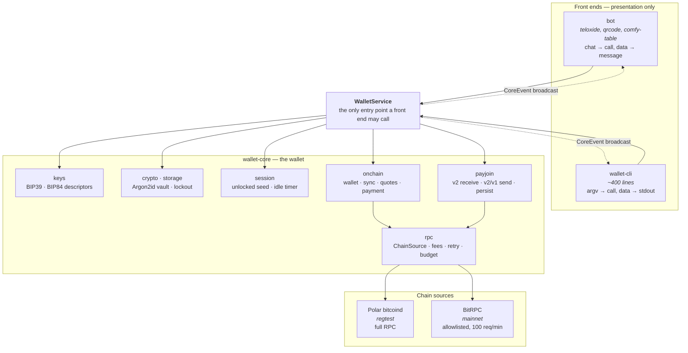
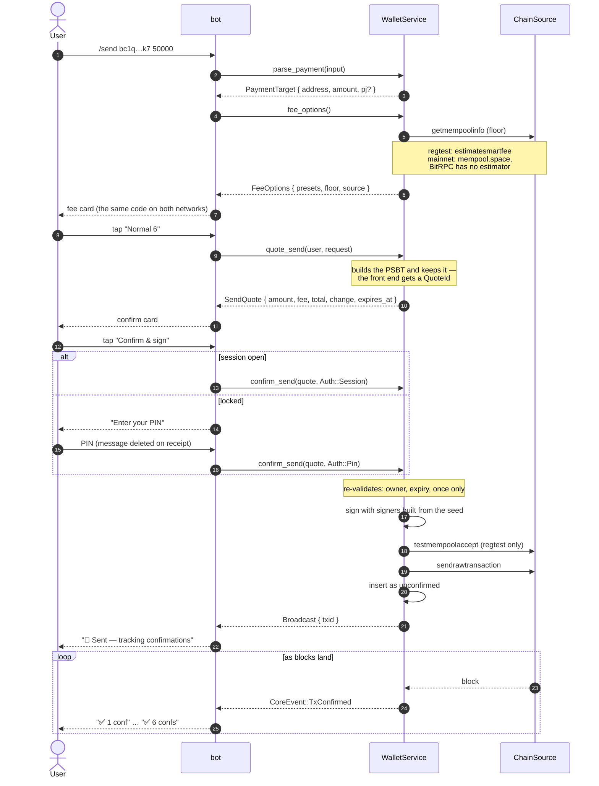

# Architecture

The split between `wallet-core` and its front ends is the load-bearing decision
in this project. Everything else follows from it.

## The layers



Read the arrows: every solid one points down, and the dotted ones carry *data*
back rather than control. Core never calls a front end and never waits for one.

## The six rules, and what enforces each

| Rule | Enforced by |
|---|---|
| No Telegram types below the boundary | `cargo tree -p wallet-core` must not contain `teloxide`, `qrcode`, `image` or `comfy-table` — a test shells out and asserts it |
| No presentation below the boundary | A test greps `wallet-core` for emoji; error variants carry data and the sentences live in `ui::render_error` |
| No user identity below the boundary | Core knows `UserId(Uuid)`. The bot owns `telegram_users`; the CLI owns `--user` |
| Core never waits for a human | Every decision is `quote_*` → `confirm_*`. There is no callback into a front end anywhere in the crate |
| Core owns every secret | `session.rs` is in core, and the seed is reachable only through a closure — no method on `Sessions` returns one |
| Core pushes events, it does not send messages | `subscribe()` hands out a `broadcast::Receiver<CoreEvent>`; `notify.rs` is a subscriber |

The second front end is what makes these true rather than aspirational.
`wallet-cli` was written against the same API, and anything it could not do
without reaching past the facade would be a leak.

## Sending a payment

The two-call shape is the whole reason core can put a human in the loop without
ever blocking on one.



Note what the front end never holds: the PSBT, the seed, and any number it could
replay. The callback data carries a ULID and nothing else, so a replayed button
can only reference a quote core will re-check or reject.

## Receiving a payjoin

```mermaid
sequenceDiagram
    autonumber
    actor Receiver
    participant Bot as bot
    participant Core as WalletService
    participant Dir as Payjoin directory<br/>(via OHTTP relay)
    actor Sender

    Receiver->>Bot: /pj_receive 50000
    Bot->>Core: payjoin_receive(user, amount)
    Core->>Dir: fetch OHTTP keys
    Core->>Core: ReceiverBuilder → session, event log
    Core-->>Bot: PayjoinReceipt { bip21 }
    Bot-->>Receiver: QR + "what payjoin does"

    Note over Core,Dir: a task in core polls; any front end<br/>— or none — sees it through

    Receiver-->>Sender: the BIP21 URI, out of band
    Sender->>Dir: Original PSBT

    loop until posted or expired
        Core->>Dir: poll
    end
    Core-->>Bot: CoreEvent::Payjoin(ProposalReceived)

    Note over Core: the checks, in order
    Core->>Core: check_broadcast_suitability
    Note right of Core: regtest: real testmempoolaccept<br/>mainnet: best-effort substitute —<br/>weaker, which is why the<br/>fallback matters more there
    Core->>Core: check_inputs_not_owned
    Core->>Core: check_no_inputs_seen_before
    Core->>Core: identify_receiver_outputs
    Core->>Core: commit_outputs
    Core->>Core: contribute_inputs (one UTXO)
    Core->>Core: commit_inputs
    Core->>Core: apply_fee_range
    Core->>Core: finalize_proposal (sign)
    Core->>Dir: post the proposal
    Core-->>Bot: CoreEvent::Payjoin(ProposalSent)

    alt the sender completes it
        Sender->>Core: broadcasts the payjoin
        Core-->>Bot: Payjoin(Completed)
        Bot-->>Receiver: "🤝 Payjoin ✅"
    else timeout or refusal
        Core-->>Bot: Payjoin(FellBack)
        Bot-->>Receiver: "Sent as a regular transaction"
    end
```

The session is an **event log**, not a serialised state machine, so a restart
replays it and carries on. The polling loop replays on every pass rather than
holding state in memory — which means the restart path is exercised constantly
instead of only after a crash.

## Where the hosted backend changes the design

`Capabilities` carries the BitRPC allowlist as data, so the layers above branch
on a capability rather than on a network name — and so a front end can *say*
what is missing instead of quietly returning an empty result.

| Missing on mainnet | Consequence | Where |
|---|---|---|
| `getrawmempool` | Unconfirmed **incoming** is invisible until a block | `onchain/sync.rs`; `BalanceView.unconfirmed_incoming_visible` |
| `estimatesmartfee` | Estimates come from mempool.space, floored at `mempoolminfee`, with a manual rate always available | `rpc/fees.rs` |
| `testmempoolaccept` | No dry run before broadcast; payjoin's suitability check is best-effort | `service::broadcast`, `payjoin/receive.rs` |
| `generatetoaddress` | `/mine` is regtest-only | `service::mine` |

And one limit that is not a missing method: **100 requests per minute per key,
shared by every user of the instance**. One `CallBudget` gates every mainnet
call, and the block emitter draws from a smaller allowance inside it, so a sync
backlog can never starve an interactive `/send`.

## Exporting the SVG

The diagrams above render on GitHub as-is. For a standalone
`docs/architecture.svg`:

```bash
npx -y @mermaid-js/mermaid-cli -i docs/architecture.md -o docs/architecture.svg
```
